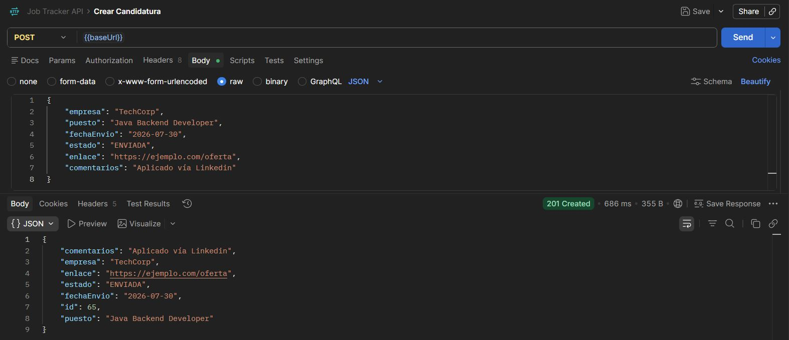
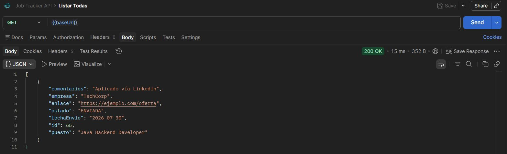

# Job Tracker API


API REST desarrollada con Spring Boot para gestionar el proceso de búsqueda de empleo: registrar candidaturas, hacer seguimiento de su estado (enviada, entrevista, descartada, oferta) y centralizar la información que normalmente se lleva en una hoja de cálculo.

Proyecto personal desarrollado como parte de mi aprendizaje de Spring Boot, aplicando una arquitectura en capas (Controller - Service - Repository) sobre un caso de uso real, con persistencia real en PostgreSQL, migraciones versionadas con Flyway, y despliegue en producción con Docker.

## 🚀 Demo en vivo

La API está desplegada y accesible públicamente en Render:

**[https://job-tracker-44ay.onrender.com/api/candidaturas](https://job-tracker-44ay.onrender.com/api/candidaturas)**

> ⚠️ El servicio usa el plan gratuito de Render, así que si lleva un rato sin recibir tráfico, la primera petición puede tardar hasta 50 segundos en responder mientras se "despierta".

## Tecnologías utilizadas

- Java 21
- Spring Boot 4
- Spring Web (API REST)
- Spring Data JPA
- PostgreSQL 16
- Flyway (migraciones de base de datos versionadas)
- Docker & Docker Compose
- Maven

## Arquitectura

El proyecto sigue una arquitectura en capas estándar de Spring Boot:
- **Controller**: expone los endpoints REST y gestiona las respuestas HTTP (`ResponseEntity`)
- **Service**: contiene la lógica de negocio, actuando como intermediario entre el Controller y el Repository
- **Repository**: gestiona el acceso a la base de datos mediante Spring Data JPA
- **Model**: define la entidad `Candidatura`, mapeada a la base de datos

## Persistencia y migraciones

La estructura de la base de datos está controlada mediante **Flyway**, no por Hibernate: cada cambio de esquema vive como un script SQL versionado en `src/main/resources/db/migration`. Hibernate se limita a `validate` el esquema contra las entidades, sin crear ni modificar tablas automáticamente — un enfoque más predecible y trazable que el `ddl-auto=update` típico de proyectos de aprendizaje.

## Endpoints disponibles

| Método | Endpoint                  | Descripción                          |
|--------|----------------------------|---------------------------------------|
| GET    | `/api/candidaturas`        | Lista todas las candidaturas          |
| GET    | `/api/candidaturas/{id}`   | Busca una candidatura por su id       |
| POST   | `/api/candidaturas`        | Crea una nueva candidatura            |
| PUT    | `/api/candidaturas/{id}`   | Actualiza una candidatura existente   |
| DELETE | `/api/candidaturas/{id}`   | Elimina una candidatura                |

### Ejemplo de body para crear/actualizar (POST/PUT)
```json
{
    "empresa": "Nombre Empresa",
    "puesto": "Backend Junior Java",
    "fechaEnvio": "2026-07-30",
    "estado": "ENVIADO",
    "enlace": "https://ejemplo.com/oferta",
    "comentarios": "Aplicado vía LinkedIn"
}
```
Valores recomendados para `estado` (aún no forzados por validación en esta versión): `ENVIADO`, `ENTREVISTA`, `DESCARTADO`, `OFERTA`.

## Capturas de la API en funcionamiento

**Creación de una candidatura (POST):**


**Listado de candidaturas (GET):**


## Cómo ejecutarlo localmente

1. Clona el repositorio
```bash
   git clone https://github.com/CarlosRojasCode/Job-Tracker.git
```
2. Entra en la carpeta del proyecto
```bash
   cd Job-Tracker
```
3. Levanta la base de datos PostgreSQL con Docker Compose
```bash
   docker compose up -d
```
4. Ejecuta la aplicación con el wrapper de Maven (Flyway aplicará las migraciones automáticamente al arrancar)
```bash
   ./mvnw spring-boot:run
```
5. La API estará disponible en `http://localhost:8080/api/candidaturas`

> La conexión a la base de datos local se configura en `src/main/resources/application.properties`. En producción, esos mismos valores se inyectan mediante variables de entorno (`SPRING_DATASOURCE_URL`, `SPRING_DATASOURCE_USERNAME`, `SPRING_DATASOURCE_PASSWORD`), nunca hardcodeados en el código.

## Despliegue

La aplicación está containerizada con un `Dockerfile` multi-stage (build con JDK, ejecución con JRE, para minimizar el tamaño de la imagen final) y desplegada en [Render](https://render.com) junto a una instancia gestionada de PostgreSQL.

## Próximas mejoras

- Manejo de errores centralizado con `@ControllerAdvice`
- Validaciones de los datos de entrada con Bean Validation (incluyendo forzar los valores válidos de `estado`, posiblemente mediante un `enum`)
- Endpoint de estadísticas (candidaturas por estado, tasa de respuesta)
- Tests automatizados (unitarios e integración)
- Pipeline de CI/CD para despliegue automático en cada push

## Autor
Carlos Rojas — [LinkedIn](https://www.linkedin.com/in/carlosrojasanchez/) · [GitHub](https://github.com/CarlosRojasCode)
